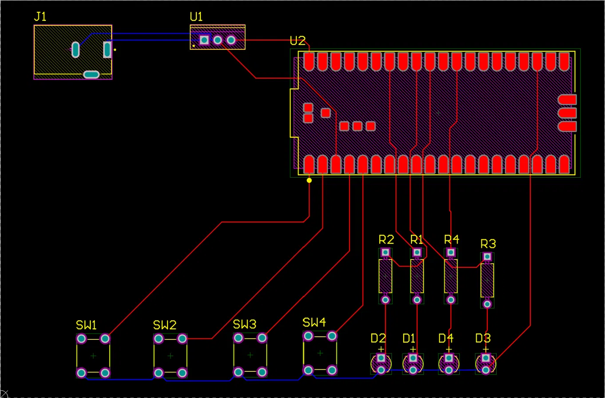

# Simon Says — Custom PCB and Embedded Firmware

A Simon Says memory game built end-to-end: schematic capture, custom PCB
layout, fabrication release, firmware, and hardware bring-up.

The player watches a sequence of LED flashes and repeats it on four buttons.
Each round adds one step to the sequence.



## Hardware

A 2-layer FR-4 board designed in Altium Designer, roughly 115 x 75 mm, built
entirely from through-hole parts. Signals route on the top layer with ground
returned on the bottom. Power comes from a barrel jack through a linear
regulator rather than USB, so the board runs standalone.

| Ref | Part | Notes |
| --- | --- | --- |
| U2 | Raspberry Pi Pico (SC0915) | RP2040, 49-pin module |
| U1 | L7805CV | 5 V linear regulator, TO-220 |
| J1 | PJ-102A | 2.0 x 6.5 mm DC barrel jack |
| SW1-SW4 | TS-1109 | Tactile SPST, 4-pin through-hole |
| 4x LED | 304090040 | Green, 20 mA, 2-pin through-hole |
| 4x R | MFR-25FBF52-100R | 100 ohm, 1%, 0.25 W, axial |

**Stackup:** Top copper / FR-4 core 59 mil (Dk 4.3) / bottom copper,
0.7 mil copper per layer, solder resist both sides.

### Pin mapping

| Function | GPIO |
| --- | --- |
| SW1-SW4 | GP0, GP1, GP2, GP3 |
| LEDs | GP28, GP27, GP26, GP22 |

Buttons pull to ground with no external pull-up resistors on the board, so
the RP2040's internal pull-ups are enabled in firmware and a pressed button
reads logic 0.

## Firmware

MicroPython, in `firmware/main.py`.

Each round appends one random step to the sequence and plays the whole thing
back, then reads the player's entries one at a time and compares against the
target. A wrong entry runs a failure animation and clears the sequence.

Two details worth calling out:

**Release-edge detection.** Reading the button level in a loop counts one
press per iteration for as long as the button is held, so a single long press
registers as several entries. `wait_for_release()` blocks until the contact
opens again before the press is accepted.

**Hardware-seeded PRNG.** Without an explicit seed, the game can deal an
identical sequence on every power cycle. `os.urandom()` on the RP2040 draws
from the ring oscillator, so each boot starts from a different state.

## Flashing

1. Install MicroPython on the Pico (hold BOOTSEL while plugging in via USB,
   then drag the UF2 onto the drive that appears).
2. Copy `firmware/main.py` to the board:

```
pip install mpremote
mpremote connect list
mpremote fs cp firmware/main.py :main.py
```

The game starts automatically on power-up once `main.py` is on the board.

## Known issues

- **No decoupling capacitors on the regulator.** The L7805 datasheet calls
  for roughly 0.33 uF on the input and 0.1 uF on the output. Neither is on
  the current board.
- **Regulator library mismatch.** The placed schematic symbol comes from an
  L4940 library part while the comment field reads L7805CV. The two are
  pin-compatible in TO-220 so the board works, but a generated BOM would
  order the wrong regulator.
- **No audio.** The board has no buzzer or driver circuitry, so gameplay is
  visual only.

## Repository layout

```
simon-says-pcb/
├── README.md
├── firmware/
│   └── main.py
└── hardware/
    ├── JacobSimonSays.SchDoc
    ├── PCB1.PcbDoc
    ├── schematic.png
    └── pcb-layout.png
```
